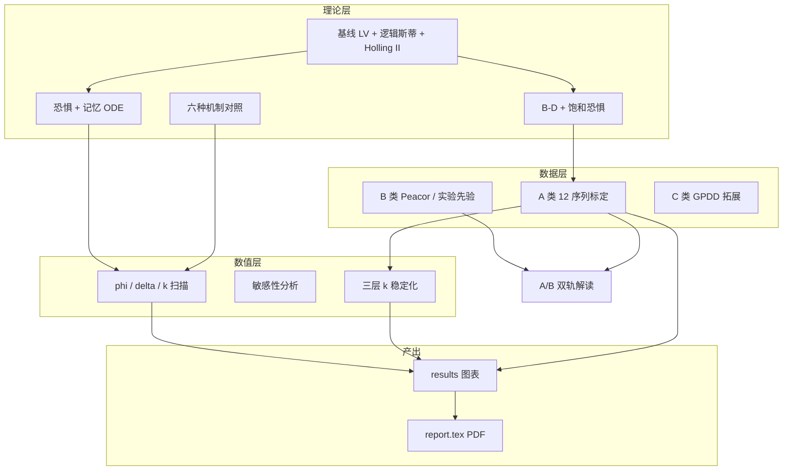

# 恐惧效应下捕食者—猎物动力学建模与数值分析

<p align="center">
  <b>Fear-effect predator–prey dynamics</b><br>
  ODE modeling · mechanism comparison · multi-source calibration · dual-track validation
</p>

<p align="center">
  数学建模课程项目 · 中国科学技术大学 · 2026 年 5 月
</p>

<p align="center">
  <a href="https://github.com/Maodawang66/fear-predator-prey-modeling">GitHub 仓库</a> ·
  <a href="report.pdf">主论文 PDF</a> ·
  <a href="摘要.pdf">开题 PDF</a> ·
  <a href="教程.pdf">读懂教程 PDF</a>
</p>

---

## 目录

- [项目背景与问题](#项目背景与问题)
- [研究内容与创新点](#研究内容与创新点)
- [方法论总览](#方法论总览)
- [数学模型详解](#数学模型详解)
- [数据体系：A/B/C 与双轨验证](#数据体系abc-与双轨验证)
- [仓库结构与代码模块](#仓库结构与代码模块)
- [环境与安装](#环境与安装)
- [复现指南（分步）](#复现指南分步)
- [主要输出文件说明](#主要输出文件说明)
- [主要结果与解读边界](#主要结果与解读边界)
- [文档清单](#文档清单)
- [常见问题](#常见问题)
- [团队成员](#团队成员)
- [许可与引用](#许可与引用)

---

## 项目背景与问题

### 课程题目

在经典**捕食者—猎物动力学**模型中引入**恐惧因子**或**记忆效应**，要求模型体现捕食、繁殖、死亡、环境容量等因素；研究恐惧对种群**共存**、**周期振荡**或**崩溃/灭绝**的影响；与无恐惧基线对比，并通过参数实验与敏感性分析说明定性行为变化。

### 生态学动机

| 效应类型 | 含义 | 典型表现 |
|----------|------|----------|
| **消耗性效应 CE** | 捕食者直接减少猎物数量（被吃/被杀） | 经典 LV / Holling 捕食项 |
| **非消耗性效应 NCE** | 猎物因“害怕”而改变行为，未必立即死亡 | 少觅食、少繁殖、躲藏 ↑ |

Preisser 等指出：在许多系统中 **TMI（性状介导）与 DMI（密度介导）同量级**，只建模“吃掉”可能低估生态后果。Zanette 等实验表明：仅播放捕食者叫声即可显著压低繁殖成功率；Peacor & Werner 表明**视觉风险线索**即可改变猎物生长——NCE **不需要物理接触**。

### 建模现实困难

公开数据中，**“恐惧强度 + 长期双物种丰度”** 极少同现：

- 行为实验（珊瑚、豆娘）能量化恐惧，但缺数十年 $x(t),y(t)$；
- 经典序列（哈德逊湾猞猁–雪兔）有长期动态，但未直接测定 $\phi$ 或 $k$。

本项目采用 **种群序列标定 + 独立机制先验** 的组合策略，并对参数不可识别性作**诚实边界**报告（见论文“不足与改进”）。

---

## 研究内容与创新点

### 研究问题

1. 在 ODE 框架中，恐惧与记忆如何改变共存、振荡与灭绝？
2. 恐惧进入方程的**路径**（繁殖抑制 / 攻击率 / 处理时间 / B–D 等）是否改变定性结论？
3. B–D + 饱和恐惧模型能否拟合多条真实时间序列？跨类群是否可标定？
4. 独立元分析/实验先验是否支持保留 NCE 通道？量级是否与 A 轨 $\eta$ 同阶？
5. （拓展）2D 反应–扩散下是否存在 Turing 斑图？与 1D 时间动力学结论是否一致？

### 项目创新点（摘要）

| 维度 | 内容 |
|------|------|
| **双主线模型** | 主模型：繁殖抑制 + 指数记忆（满足记忆效应）；拓展：Myint (2025) B–D + $1/(1+kv)$ 恐惧因子（服务标定） |
| **机制—数据—稳定化** | 六种 NCE 路径对照 + 12 序列三模型 RMSE + $k$ 三层稳定化（特征值 / 振幅 / 峰值衰减） |
| **A/B 双轨验证** | A 轨：标定后等效抑制 $\eta$ 跨哺乳/鱼/浮游；B 轨：Peacor/珊瑚/豆娘独立先验，**两轨不可混读** |
| **诚实边界** | $k$ profile、多参数耦合、Turing 仅附录、敏感性在灭绝态下的解释 |

---

## 方法论总览



**数值工具**：`scipy.integrate.solve_ivp`（RK45，$10^{-6}$ 相对误差）；标定用差分进化；2D PDE 为有限差分拓展（`src/pde2d.py`）。

---

## 数学模型详解

### 符号约定

| 符号 | 含义 |
|------|------|
| $x$ 或 $u$ | 猎物密度 |
| $y$ 或 $v$ | 捕食者密度 |
| $r,K$ | 内禀增长率、环境容量 |
| $a,\theta,e,m$ | 攻击率、半饱和、转化效率、捕食者死亡率 |
| $\phi,\delta$ | 恐惧强度、记忆衰减（主模型） |
| $k$ | B–D 模型饱和恐惧强度 |
| $\eta(k,v)=kv/(1+kv)$ | 等效繁殖抑制比例（跨系统比较用） |

### 1. 无恐惧基线（Holling II）

$$\dot{x} = rx\left(1-\frac{x}{K}\right) - \frac{axy}{1+\theta x}, \qquad
\dot{y} = \frac{eaxy}{1+\theta x} - my$$

对应代码默认参数：`src/parameters.py` → `baseline_default`。

### 2. 恐惧 + 记忆主模型（题目主线）

$$\dot{x} = rx\left(1-\frac{x}{K} - \phi v\right) - \frac{axy}{1+\theta x}, \qquad
\dot{y} = \frac{eaxy}{1+\theta x} - my, \qquad
\dot{v} = \delta(y - v)$$

- $v(t)$：捕食者密度的**指数核记忆状态**（风险解除后仍滞后抑制繁殖）；
- $\phi$ 增大 → 有效繁殖率下降 → 易趋向**灭绝类**（$\bar{y}<10^{-3}$）。

对应三模型之一：`fear_memory`（`integrate_fear_memory`）。

### 3. B–D + 饱和恐惧（数据标定主模型）

$$\frac{du}{dt} = \frac{ru}{1+kv} - du - au^2 - \frac{puv}{1+qu+v}, \qquad
\frac{dv}{dt} = v\left(-m + \frac{cpu}{1+qu+v}\right)$$

- 繁殖项 $ru/(1+kv)$：Wang (2016) 型**饱和恐惧因子**；
- 分母 $1+qu+v$：Beddington–DeAngelis 功能反应（猎物干扰 + 捕食者干扰）；
- 与主模型**相互印证、非相互替代**；12 条序列 RMSE 以 `bda_fear` 为主。

对应三模型之一：`bda_fear`（`bd_fear_rhs` + `data/calibrate_bda.py`）。

### 4. 六种 NCE 机制对照

在同一 CE 基线上，仅改变恐惧进入通道（`src/literature.py`）：

| 机制 | 修改方式 | 默认参数下长期结局（概要） |
|------|----------|---------------------------|
| 基线 Holling II | 无恐惧 | 依参数而定 |
| 瞬时繁殖抑制 | $-r\phi y x$ | 多趋向振荡/灭绝 |
| 记忆繁殖抑制 | $-r\phi M x$，$\dot M=y-\delta M$ | 滞后抑制 |
| 觅食抑制 | $a_{\mathrm{eff}}=a/(1+\psi y)$ | 降低攻击率 |
| 处理时间延长 | 分母 $(1+\theta x+\omega y)$ | 饱和捕食 |
| **B–D + 恐惧** | 式 (3) | **唯一稳定共存**（$\bar{u}\approx 4.98,\ \bar{v}\approx 5.14$） |

**路径依赖结论**：恐惧写进方程的方式不同，定性结论可完全不同——不宜将主模型 $\phi$ 扫描的“全灭绝”直接推广到 B–D 框架。

### 5. 三层 $k$ 稳定化检验

| 层级 | 指标 | 含义 |
|------|------|------|
| **I** | $\max\mathrm{Re}\,\lambda$ @ 共存点 | 局部稳定性（焦点/结点） |
| **II** | 相对振幅 $A/\bar{u}$ | 振荡强弱 |
| **III** | 峰值衰减比 | 阻尼程度 |

实现：`src/k_damping.py`、`k_damping_analysis.py`；图表在 `results/k_damping/`。

### 6. 2D PDE + Turing（附录拓展）

反应–扩散扩展 + 线性特征值扫描（`pde2d_turing.py`）。**结论定位**：默认 Myint 参数组下共存点为稳定焦点，Turing 窗口窄（$d_2\lesssim 0.11$），PDE 数值仍近均匀——**不作“显著斑图”主结论**，与 1D 恐惧稳定化时间动力学一致。

---

## 数据体系：A/B/C 与双轨验证

### A / B / C 三类数据

| 类别 | 目录示例 | 用途 | 规模（本项目） |
|------|----------|------|----------------|
| **A 种群动态** | `raw/01`–`04`, `07`, GPDD 子集 | ODE 三模型标定，产出 **12 条主序列** | 年/月尺度，数百～数万点 |
| **B 恐惧/NCE** | `raw/08`–`10`, `12_peacor` | $\phi,\psi,k$ 的**独立**机制先验 | Peacor 64 篇 PLP；珊瑚/豆娘实验 |
| **C 大样本拓展** | `raw/05_gpdd` | 类群—参数分布、后续批量标定 | ~5156 序列（全库） |

详细 DOI、引用与下载说明见 **[`data/数据来源.md`](data/数据来源.md)**。

### 12 条主拟合序列（A 类产出）

| 序列 ID | 生态类群 | 空间/系统 | 时间跨度 | 备注 |
|---------|----------|-----------|----------|------|
| `01_lynxhare` | 哺乳 | Hudson Bay | ~60 年 | 经典毛皮代理序列 |
| `03_andren_1`–`7` | 哺乳 | 北欧 7 区 | 1960s– | Andrén 猞猁–狍 |
| `02_glerl_m110_zoop` | 浮游 | 密歇根 M110 | 1994–2012 | CE+NCE 分离文献 |
| `02_wifishabundance_*` | 鱼 | LTER 单湖 | 长期 | 明确捕食鱼对 |
| `10–12_timeserieslogmeans_*` | 鱼 | Killifish 三站 | 5 年月度 | WRHW / TP / WRGP |

每条序列对 `baseline`、`fear_memory`、`bda_fear` 各标定一次 → **36 组** RMSE（见 `report.tex` 附录表）。

### A/B 双轨验证（不可混读）

| 轨道 | 数据来源 | 核心量 | 回答的问题 | **禁止**的误读 |
|------|----------|--------|------------|----------------|
| **A 轨** | 12 序列 ODE 标定 | $\eta(v{=}5)=5k/(1{+}5k)$，$k$ profile | B–D+恐惧 能否跨哺乳/鱼/浮游标定？空间异质多大？ | $\eta$ 中位数 ≠ “哪类动物更怕”；裸 $k$ 受 $p,q$ 耦合 |
| **B 轨** | Peacor 元分析、珊瑚、豆娘 | TMIE 比例、活动/觅食抑制 | NCE 通道是否存在？量级是否与实验同阶？ | 不能替代动态 RMSE；不能与 A 轨 $k$ 直接比大小 |

**A 轨要点**：哺乳/鱼类 $\eta(v{=}5)$ 中位数约 **0.07–0.08**，浮游约 **0.02**。  
**B 轨要点**：Peacor PLP 中 **TMIE 约 58%**；无脊椎猎物 **11/12 为 TMIE（92%）**；豆娘野生活动抑制 **~6%**；珊瑚 PropRemov **~56%**——与 A 轨 $\eta$ **同量级**，支持保留 NCE，但不宜裸比 $k$。

深度分析脚本：`data/deep_data_analysis.py` → `results/deep_analysis/tier1/`、`tier2/`。

---

## 仓库结构与代码模块

```
pro/
├── main.py                      # 一键：主模型扫描 + 机制对照 + B-D k 扫描 + k_damping 简版
├── k_damping_analysis.py        # k 扫描完整报告（CSV + 多图）
├── pde2d_turing.py              # 2D PDE 图 + Turing 特征值扫描
├── requirements.txt
│
├── src/
│   ├── model.py                 # 各方程右端项
│   ├── parameters.py            # 默认参数组
│   ├── simulate.py              # 积分封装
│   ├── analysis.py              # 扫描、平衡点、敏感性
│   ├── literature.py            # 六种机制
│   ├── fit.py                   # 标定目标函数
│   ├── visualize.py             # 全部绑图
│   ├── k_damping.py             # 三层稳定化
│   └── pde2d.py                 # 2D 有限差分 + Turing 诊断
│
├── data/
│   ├── download_datasets.py     # Dryad / LTER / GitHub 等拉取
│   ├── calibrate_bda.py         # 12 序列 × 3 模型标定
│   ├── deep_data_analysis.py    # 双轨、Peacor 类群、RMSE 汇总
│   ├── dataset_registry.py      # 数据集目录
│   └── raw/                     # 01–12 编号原始数据 + dataset.json
│
├── results/
│   ├── 01–12_*.png              # main.py 主图
│   ├── calibration_bda/         # 标定图、params/*.json
│   ├── deep_analysis/           # 双轨 JSON、Peacor 图
│   ├── k_damping/               # k 扫描图与 report.md
│   └── pde2d/                   # PDE 与 Turing 图
│
├── report.tex / report.pdf      # 主论文（~27 页）
├── 摘要.tex / 摘要.pdf          # 开题报告
├── 规划.md / 规划.pdf           # 文献与任务规划
├── 教程.md / 教程.pdf           # 零基础读懂教程
├── compile_docs.py              # Pandoc 编译 规划/教程
├── pandoc-pdf-header.tex        # 中文 PDF 表格/英文断行
└── 作业要求.md
```

### 三模型命名（全文统一）

| 代码名 | 含义 |
|--------|------|
| `baseline` | 无恐惧 Holling II（或 B–D 中 $k{=}0$） |
| `fear_memory` | 繁殖抑制 $\phi v$ + 记忆 $\dot v=\delta(y-v)$ |
| `bda_fear` | B–D + 饱和恐惧 $1/(1+kv)$ |

---

## 环境与安装

### 依赖

| 组件 | 版本建议 | 用途 |
|------|----------|------|
| Python | 3.10+ | 数值与标定 |
| numpy, scipy, matplotlib | 见 `requirements.txt` | ODE、优化、作图 |
| requests, openpyxl | 可选 | 下载数据、读 Peacor xlsx |
| XeLaTeX + ctex | 系统安装 | `report.tex` / `摘要.tex` |
| Pandoc | conda-forge | `规划.md` → PDF |

### 推荐安装（Conda）

```bash
conda create -n ai25 python=3.11
conda activate ai25
pip install -r requirements.txt
conda install -c conda-forge pandoc
# Windows 下 LaTeX 可用 TeX Live / MiKTeX，确保 xelatex 在 PATH
```

---

## 复现指南（分步）

建议按下列顺序运行；仓库已包含 `data/raw/` 与 `results/`，若仅查看论文可跳过计算步骤。

### 步骤 0：克隆仓库

```bash
git clone https://github.com/Maodawang66/fear-predator-prey-modeling.git
cd fear-predator-prey-modeling
```

### 步骤 1：主数值实验（约 1–3 分钟）

```bash
conda activate ai25
python main.py
```

生成 `results/01`–`12` 图及 `results/k_damping/` 简版输出；终端会打印 $\phi$ 扫描灭绝比例、机制对照摘要、B–D 平衡点等。

### 步骤 2：$k$ 稳定化完整版（可选）

```bash
python k_damping_analysis.py
```

输出：`results/k_damping/*.png`、`k_scan.csv`、`report.md`。

### 步骤 3：多序列标定（耗时较长，可选）

```bash
python data/calibrate_bda.py
```

输出：`results/calibration_bda/figures/`、`params/*.json`、`fit_summary.csv`。

### 步骤 4：深度分析（双轨 / Peacor）

```bash
python data/deep_data_analysis.py
# Windows:
run_deep_analysis.bat
```

输出：`results/deep_analysis/tier1/`、`tier2/`（含 `dual_track_summary.json`、`peacor_by_taxon.csv` 等）。

### 步骤 5：数据更新（可选）

```bash
python data/download_datasets.py
```

部分 Dryad 包需浏览器手动下载（见各 `raw/*/DOWNLOAD_INSTRUCTIONS.txt`）。

### 步骤 6：编译文档

```bash
latexmk -xelatex report.tex
latexmk -xelatex 摘要.tex
python compile_docs.py
```

Windows 批处理：`compile_report.bat`、`compile_docs.bat`。

### 步骤 7：PDE 拓展（可选）

```bash
python pde2d_turing.py
```

---

## 主要输出文件说明

### `main.py` → `results/`

| 文件 | 内容 |
|------|------|
| `01_timeseries_baseline_vs_fear.png` | 基线 vs 恐惧+记忆时序 |
| `02–03_phase_*.png` | 相平面 |
| `04_three_scenarios.png` | $\phi=0/0.02/0.045$ 对比 |
| `05_phi_scan.png` | $\phi$ 扫描（31 点） |
| `06_delta_scan.png` | 记忆衰减 $\delta$ 扫描 |
| `07_sensitivity.png` | 局部敏感性（注意默认态下仅 $K$ 显著） |
| `08–10_literature_*.png` | 六种机制时序/柱状/振幅 |
| `11–12_bda_fear_*.png` | B–D：$k{=}0$ vs $k{>}0$，$k$ 扫描 |

### 标定与深挖

| 路径 | 内容 |
|------|------|
| `results/calibration_bda/params/*.json` | 每条序列三模型最优参数 |
| `results/deep_analysis/tier2/dual_track_summary.json` | A/B 双轨汇总 |
| `results/deep_analysis/tier2/peacor_by_taxon.csv` | Peacor 按类群统计 |
| `results/k_damping/` | $k$–特征值/振幅/衰减 |
| `results/pde2d/` | PDE 面板与 Turing 扫描 |

---

## 主要结果与解读边界

### 理论数值

1. **主模型 $\phi$ 扫描**：31/31 为灭绝类 → 在 Holling II + 繁殖抑制框架下，强恐惧易破坏共存。  
2. **$\delta$ 扫描**：记忆越长（$\delta$ 越小），平均密度越低 → 符合风险滞后抑制。  
3. **六种机制**：仅 **B–D+恐惧** 在默认参数下给出稳定共存焦点。  
4. **$k$ 扫描**：共存密度随 $k$ 增大而压缩；$\max\mathrm{Re}\,\lambda$ 从约 $-0.628$ 升至 $-0.389$，**全程稳定**（无 Hopf 失稳）。

### 真实数据

5. **RMSE**：`bda_fear` 在 **12/12** 序列最优，范围约 **0.054–0.209**；较 `baseline` 改进 **$10^2$–$10^6$** 倍（因 baseline 在多条序列上几乎无法捕捉振荡形态）。  
6. **双轨**：A 轨 $\eta$ 与 B 轨 TMIE/实验抑制**同量级**，支持 NCE 通道；但 **禁止**用 A 轨 $k$ 直接解释 B 轨百分比，或反之。

### 敏感性图 `07_sensitivity.png` 的读法

在**默认参数**下，系统常处于**猎物贴环境容量 $K$、捕食者灭绝**的极端态，故线性敏感性中 **仅 $K$ 接近 1**，$\phi,\delta$ 等为 $10^{-5}$–$10^{-7}$ 量级——这是**状态点选择**导致，不代表参数全局不敏感。论文中已用归一化子图并列说明。

### 诚实边界（答辩建议）

- $k$ 与 $p,q,r$ 等存在**可识别性耦合**；报告 $k$ profile 而非单点“真值”。  
- Turing / PDE 为**拓展尝试**，不支持“显著空间斑图”作为主结论。  
- GPDD / BioTIME 全库标定为后续工作，正文以 12 条主序列为主。

---

## 文档清单

| 文件 | 读者 | 说明 |
|------|------|------|
| [`report.pdf`](report.pdf) | 评阅老师 | 完整论文：模型、数据、结果、双轨、附录 RMSE |
| [`摘要.pdf`](摘要.pdf) | 开题答辩 | 背景、技术路线、进度 |
| [`教程.pdf`](教程.pdf) | 零基础同学 | 生物学概念 + 公式推导 + 汇报话术 |
| [`规划.pdf`](规划.pdf) | 团队内部 | 文献矩阵、任务分工、时间表 |
| [`data/数据来源.md`](data/数据来源.md) | 复现者 | 各数据集 DOI、用法、引用格式 |
| [`data/README.md`](data/README.md) | 复现者 | 数据目录约定 |

---

## 常见问题

**Q：为什么没有把 $\phi$ 扫描的“全灭绝”当作全文唯一结论？**  
A：该结论绑定**主模型方程结构**。B–D+恐惧 在机制对照与标定中表现完全不同，需分模型陈述。

**Q：A 轨和 B 轨能否比较谁更大？**  
A：**不宜**。A 轨 $\eta$ 来自 ODE 等效参数；B 轨来自实验/元分析效应量，定义与识别性不同。

**Q：重新跑 `calibrate_bda.py` 结果会和论文略有差异吗？**  
A：差分进化有随机性，RMSE 趋势应一致（B–D+恐惧 最优），细参数可能小幅波动。

**Q：仓库很大，哪些可以删？**  
A：复现最小集：`src/`、`data/raw/` 核心 CSV、`main.py`、`requirements.txt`。`results/results/` 为历史重复目录，可忽略。

---

## 团队成员

| 姓名 | 学号 | 分工（概要） |
|------|------|----------------|
| 贺小轩 | PB23151820 | 模型建立、论文撰写 |
| 李松茂 | PB23151824 | 数值实验、数据标定 |
| 王玉麟 | PB23151808 | 数据处理、图表与文档 |

**课程**：数学建模 · 中国科学技术大学  
**指导场景**：课程大作业 / 开题 / 期末论文

---

## 许可与引用

- 本项目代码与文档仅供**课程与学术交流**；勿将第三方数据集再分发时违反 Dryad、KNB、LTER 等许可。  
- 引用本仓库可注明：  
  `Maodawang66/fear-predator-prey-modeling`（2026）. Fear-effect predator–prey dynamics modeling project. GitHub.  
- 使用具体数据集请引用 **`data/数据来源.md`** 中列出的原始文献与 DOI。

**问题反馈**：[GitHub Issues](https://github.com/Maodawang66/fear-predator-prey-modeling/issues)

---

<p align="center">
  <a href="https://github.com/Maodawang66">@Maodawang66</a> ·
  <a href="https://github.com/Maodawang66/fear-predator-prey-modeling">fear-predator-prey-modeling</a>
</p>
